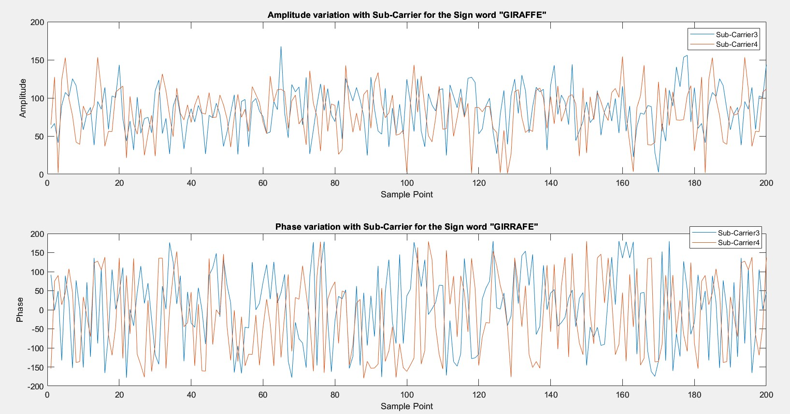
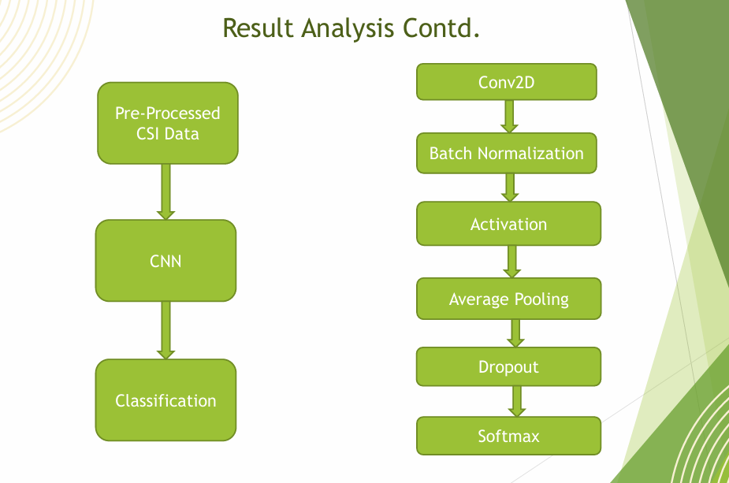

# Implementation-Friendly-CNN-For-Sign-Language-Recognition-Using-Wi-Fi-CSI-Data

##### **SignFi: WiFi-Based Sign Language Recognition Using CSI and CNN**

This repository presents an ***implementation-friendly CNN-based system*** for sign language recognition using \*\*Wi-Fi Channel State Information (CSI)\*\*. Inspired by \*\*SignFi\*\*, the project leverages wireless signals and deep learning to enable accurate, privacy-preserving gesture recognition without cameras or wearable devices. 

###### **Overview**

1. Utilizes **Wi-Fi CSI measurements** from access points
2. Employs a **lightweight 1-layer CNN** for efficient gesture classification
3. Supports large-scale sign vocabularies (up to **276 gestures**)
4. Designed for reproducibility and ease of implementation

###### **Key Highlights**

* **Average Accuracy:**
 &nbsp; 97.64% (Lab),
 &nbsp;  98.85% (Home)
* Evaluated with **5 users**, achieving **84.63% accuracy** on 7,500 samples across 150 gestures
* Performance improves with fewer gesture classes

###### **Dataset**

* Preprocessed Home Downlink CSI data is provided in the `Data/` folder

* CSI data format: `(200, 30, 3, n)`

 * 200 time samples

* 30 subcarriers

 * 3 antennas

 * `n` samples

###### **Repository Structure**

* `Data/` – Subset of Preprocessed Home Downlink CSI data

* `Code/` – CSI preprocessing pipeline (filtering, correction, Final CNN model and training scripts

* `Deliverables/` –

 * Main research paper
 * Reference paper used for preprocessing

###### **Model**

* **1-layer CNN architecture**

* Includes: Conv2D, Batch Normalization, Activation, Average Pooling, Dropout, Softmax

* Optimized for simplicity while maintaining high accuracy

#### Project Status

✅ Completed — Baseline implementation

🔧 Open for enhancements and upgrades

###### **Acknowledgements**

Special thanks to **Dr. Hafiz Imtiaz** and **Dr. Tahsina Farah Sanam** for their valuable guidance and support throughout this project. And this project is Implemented from the dataset and method provided in [SignFi](https://yongsen.github.io/SignFi/) Paper.

###### **Author**

**Joy Saha**

Bangladesh University of Engineering and Technology (BUET)

###### **References**

Y. Ma, G. Zhou, S. Wang, H. Zhao, and W. Jung, “Signfi: Sign language recognition using wifi,” Proceedings of the ACM on Interactive, Mobile, Wearable and Ubiquitous Technologies, vol. 2, no. 1, pp. 1–21, 2018.

#### **License**

This project is for academic and educational purposes.

