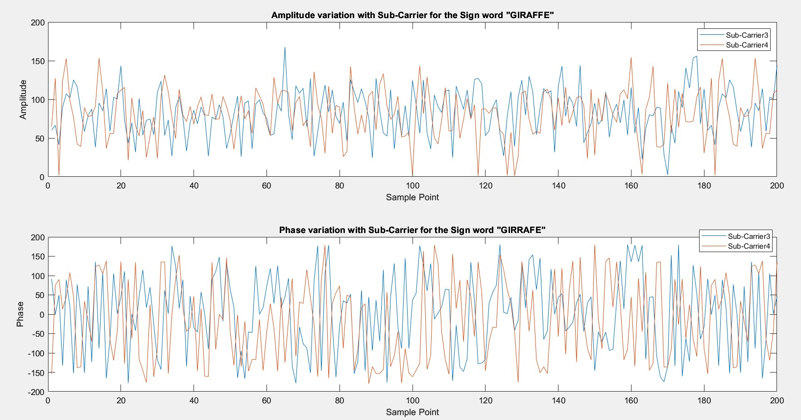
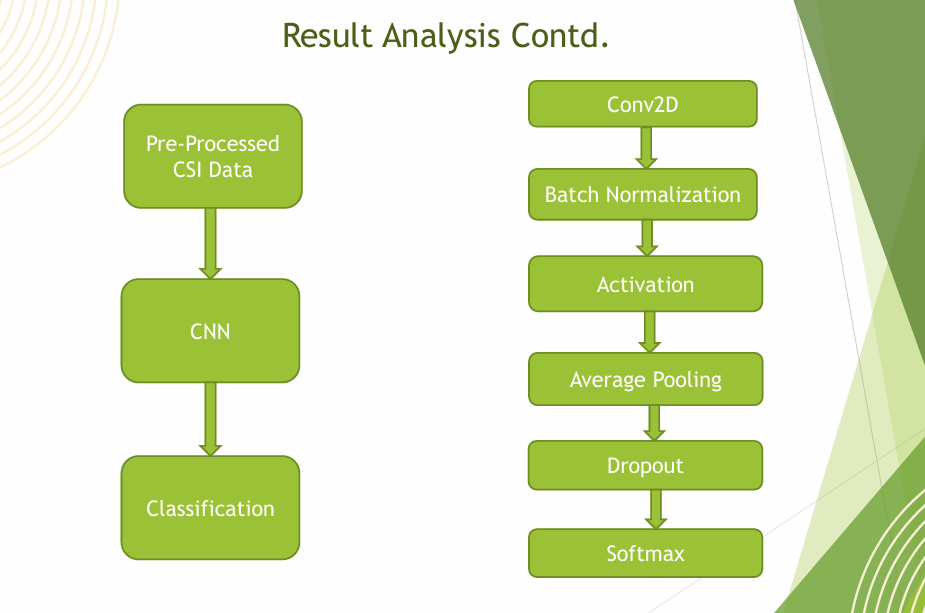
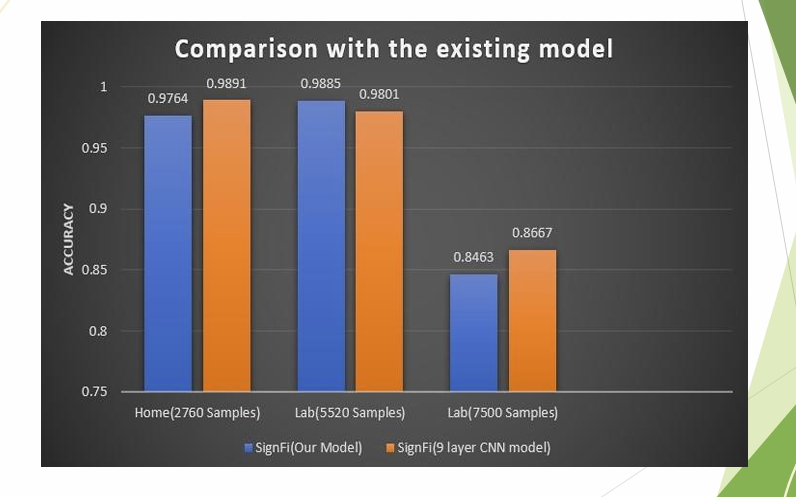

# Implementation-Friendly CNN for Sign Language Recognition Using Wi-Fi CSI Data

This repository presents an **implementation-friendly CNN-based system** for sign language recognition using **Wi-Fi Channel State Information (CSI)**. Inspired by **SignFi**, the project leverages wireless signals and deep learning to enable accurate, privacy-preserving gesture recognition without cameras or wearable devices.

---

## Overview

1. Utilizes **Wi-Fi CSI measurements** from access points  
2. Employs a **lightweight single-layer CNN** for efficient gesture classification  
3. Supports large-scale sign vocabularies (up to **276 gestures**)  
4. Designed for reproducibility and ease of implementation  

---

## Key Highlights

- **Average Accuracy:**  
  - 97.64% (Lab environment)  
  - 98.85% (Home environment)

- Evaluated with **5 users**, achieving **84.63% accuracy** on 7,500 samples across 150 gestures  
- Performance improves as the number of gesture classes decreases  

---

## Dataset

- Preprocessed Home Downlink CSI data is provided in the `Data/` folder  
- CSI data format: `(200, 30, 3, n)`

  - 200 time samples  
  - 30 subcarriers  
  - 3 antennas  
  - `n` gesture samples  

---

## Repository Structure

- `Data/` – Subset of preprocessed Home Downlink CSI data  
- `Code/` – CSI preprocessing pipeline (filtering, correction), final CNN model, and training scripts  
- `Deliverables/`  
  - Main research paper  
  - Reference paper used for preprocessing  

---

## Model

- **Single-layer CNN architecture**  
- Components include:
  - Conv2D  
  - Batch Normalization  
  - Activation  
  - Average Pooling  
  - Dropout  
  - Softmax  

- Optimized for simplicity while maintaining high accuracy  

---

## Project Status

✅ **Completed** — Baseline implementation  

🔧 **Open for enhancements and upgrades**

---

## Acknowledgements

Special thanks to **Dr. Hafiz Imtiaz** and **Dr. Tahsina Farah Sanam** for their valuable guidance and support throughout this project.  
This work is implemented using the dataset and methodology provided in the **SignFi** paper.

---

## Author

**Joy Saha**  
Bangladesh University of Engineering and Technology (BUET)

---

## References

1. Y. Ma, G. Zhou, S. Wang, H. Zhao, and W. Jung,  
   *“SignFi: Sign language recognition using WiFi,”*  
   Proceedings of the ACM on Interactive, Mobile, Wearable and Ubiquitous Technologies,  
   vol. 2, no. 1, pp. 1–21, 2018.

2. T. F. Sanam and H. Godrich,  
   *“FuseLoc: A CCA-Based Information Fusion for Indoor Localization Using CSI Phase and Amplitude of WiFi Signals,”*  
   ICASSP 2019, Brighton, UK, pp. 7565–7569.

---

## License

This project is for **academic and educational purposes only**.
